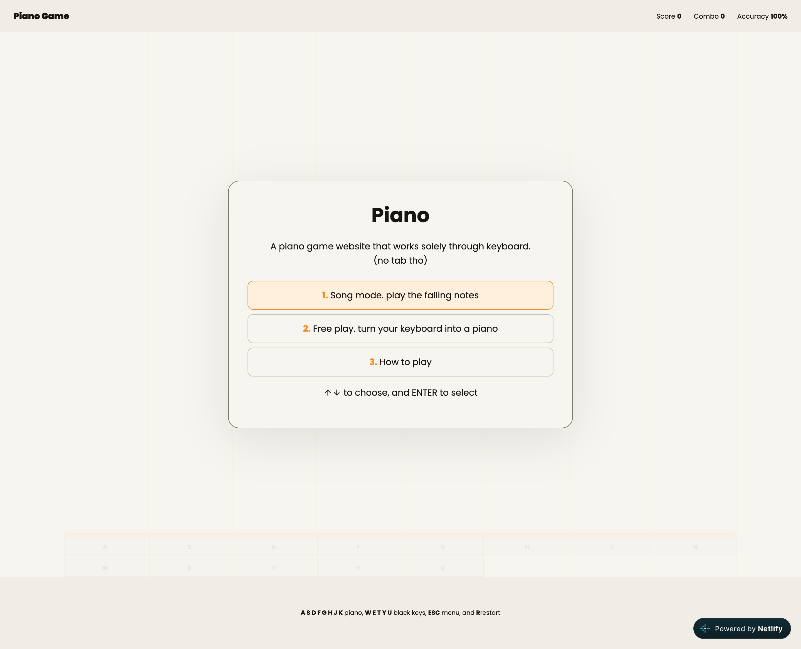

<h1>Piano Game</h1>

A piano game website that works solely through keyboard.(no tab tho)

 

 
<h3>Tech Stack</h3>
<ul>
<li>HTML</li>
<li>CSS</li>
<li>JavaScript</li>
</ul>
 
<h3>Features</h3>
<ul>
<li>Clean and Simple Design</li>
<li>Responsive</li>
<li>Entertaining</li>
</ul>
 
<h3>Live Demo</h3>
<a href="https://piano-game-rojen.netlify.app/">click me!</a>
 
<h3>Github Repo</h3>
<a href="https://github.com/rojen-chakradhar/piano-game">click me!</a>
 
<h3>Note</h3>

I know the color of the text of the keys are hard to see but idk how to fix it. i even tried chatgpt but its not working. I tried everything, not nothinhg working.

 
<h3>AI Usage</h3>

I used chatgpt a lil cuz it was not working.
